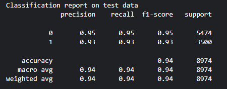

# AI-Generated Text Detection Application

## Project Overview
This project aims to detect whether a given piece of text is generated by AI or written by a human. The model leverages various machine learning techniques including Support Vector Machines (SVM), Naive Bayes, Logistic Regression and Artificial Neural Networks (ANN) to achieve high accuracy. Also voting classifier is used to combine the predictions from Naive Bayes, Support Vector Machine and Logistic Regression to give prediction.

### Model Evaluation


- Naive Bayes Classifier


- Support Vector Machine


- Logistic Regression



- Voting Classifier


- ANN


### Database used
https://www.kaggle.com/datasets/thedrcat/daigt-v2-train-dataset

## Steps to run the program on Windows
1. Create a virtual environment 
```
python -m venv "your environment name here"
```
2. Activate the virtual environment
```
"your environment name here"\Scripts\activate.bat
```
3. Install all required libraries
```
pip install -r requirements.txt
```
4. Run the program
```
streamlit run app.py
```